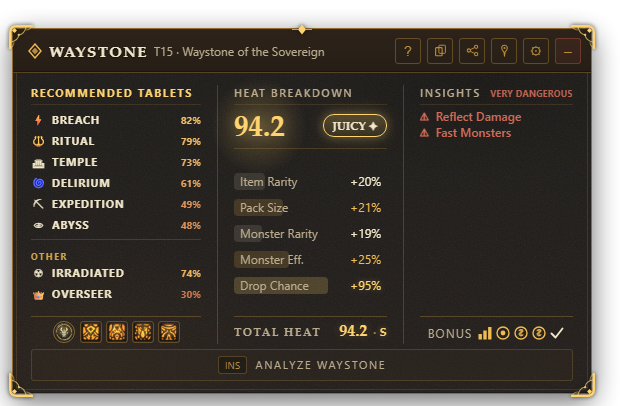

# Waystone Analyzer

[](https://github.com/Captain-VII/poe2-waystone-analyzer/releases/latest)
[](#requirements)
[](https://tauri.app)

An in-game overlay for **Path of Exile 2**. Hover a Waystone, press **Ins**,
and see at a glance whether it's worth running, which tablet to slot, and
which Atlas Master fits, without alt-tabbing.



## Contents

- [Quick start](#quick-start)
- [Keys](#keys)
- [Reading the overlay](#reading-the-overlay)
- [How the Juice Score works](#how-the-juice-score-works)
- [Settings](#settings)
- [Customizing with meta.json](#customizing-with-metajson)
- [Updates, game data and privacy](#updates-game-data-and-privacy)
- [Troubleshooting](#troubleshooting)
- [Reporting a problem](#reporting-a-problem)

## Quick start

1. Download `Waystone-Analyzer_<version>_x64-setup.exe` from the
   [latest release](https://github.com/Captain-VII/poe2-waystone-analyzer/releases/latest).
2. Run it. It installs for your user only, no admin rights. Windows may show
   a SmartScreen warning because the installer isn't code-signed: click
   **More info → Run anyway**.
3. In game, hover a Waystone and press **Ins**.

### Requirements

- Windows 10 or 11
- [Microsoft Edge WebView2 Runtime](https://developer.microsoft.com/microsoft-edge/webview2/),
  already present on almost every Windows install. If the overlay never
  appears, install it.

## Keys

| Key | Action | Works |
|---|---|---|
| **Ins** | Copy the hovered Waystone and analyze it | Anywhere, including in game |
| **Ctrl+E** | Same as Ins, always available even if you remap Ins | Anywhere |
| **Escape** | Hide the overlay | When the overlay has focus |

Your clipboard is restored after each analysis. **Ins** can be remapped in
Settings → Overlay → Hotkey (click it, press the new key). Clicking anywhere
in the game hides the overlay; the **pin** button keeps it open.

The overlay sits top-right. Drag its title bar to move it; the position is
remembered. Settings → Overlay → **Position → Reset** puts it back.

## Reading the overlay

| Column | What it shows |
|---|---|
| **Recommended Tablets** | Every tablet ranked by how well it fits this waystone, with a Run / Why not / Don't run verdict, and the **Atlas Master** for the winning mechanic |
| **Heat Breakdown** | The **Juice Score** (0-100) and its tier badge, the five stats behind it, and Total Heat |
| **Insights** | Every dangerous mod, most dangerous first, and a **Bonus** row of icons for the waystone's strengths |

- **Tier badge**: `WEAK` → `AVERAGE` → `GOOD` → `EXCELLENT` → `JUICY ✦`, at
  20 / 40 / 60 / 80. A letter (S/A/B/C/D) next to Total Heat uses the same
  bands. A Juicy find also plays a chime and shows a Windows notification.
- **Verdict**: **Skip** under 20, **Keep** at 50+ on a tier 3+ waystone
  (hold it for a good tablet), **Run** otherwise.
- **Stat bars**: each stat against its own realistic maximum, so +60% Drop
  Chance (which rolls up to ~155%) looks smaller than +60% Pack Size (~65%).
- **Danger level** (`Safe` / `Manageable` / `Dangerous` / `Very Dangerous`)
  comes from the danger mods only, never from the score. A map can be Juicy
  and Very Dangerous at once: that's for you to judge.

The **?** button opens an in-app guide with the same explanations.

## How the Juice Score works

The score is the fit of your **best real league mechanic** for this
waystone. Each mechanic cares about one stat:

| Mechanic | Priority stat |
|---|---|
| Delirium | Pack Size |
| Expedition | Item Quantity |
| Breach | Monster Effectiveness |
| Ritual, Abyss | Monster Rarity |
| Temple | Item Rarity |

That roll sets the base: under 15% Weak (10), 15-25% OK (25), 25-50% Top
(55), 50%+ Legendary (80). On top come up to +8 for the number of mods, +10
when the tablet is one of the mechanic's recommended picks, and the tablet's
own reward value (Splinters, Artifacts...). The last two only count once the
waystone is at least OK for that mechanic, so a rich tablet can't rescue a
bad roll.

- One great roll carries the score instead of being averaged down by weak
  lines.
- Overseer and Irradiated aren't league encounters: they're shown under
  "Other" but never drive the score or the Atlas Master pick.
- **Danger never lowers the score.** It measures loot potential; whether a
  Reflect map is worth it is your call.

## Settings

The gear button opens four tabs:

- **Overlay**: show/hide Insights, reduce effects, opacity, scale, hotkey,
  position reset.
- **Session**: waystones analyzed, average and best score this session,
  history of past sessions, **Export CSV**.
- **Meta**: tune each mechanic and enable/disable tablets (see below).
- **App**: launch with Windows, start minimized, version, **Beta channel**,
  check for updates, patch notes, **Export Logs**.

## Customizing with meta.json

Most tuning is in **Settings → Meta**: each mechanic's priority stat and
skip threshold, and which tablets are enabled. Clicking a tablet row opens
the same editor for that mechanic. Changes apply immediately; **Reset**
returns to defaults.

Everything is saved in `meta.json`
(`%APPDATA%\com.captain-vii.waystone-analyzer\meta.json`), which you can also edit
by hand; the app reloads it on save. **Validate meta.json** points to the
exact line of a JSON mistake. Hand-editing is how you add a custom tablet:

```json
{
  "tablets": [
    {
      "name": "My Tablet",
      "mods": ["40% increased Pack Size", "20% increased Monster Rarity"],
      "tags": ["delirium"]
    },
    { "name": "Ritual Tablet", "enabled": false }
  ]
}
```

A `name` matching a built-in tablet (case-insensitive) overrides it; any
other name adds a tablet. `mods` use the game's own wording. A tablet can
also carry `rewards` for value the stats can't express:
`{ "type": "mechanic", "id": "delirium", "value": 9 }`,
`{ "type": "currency", "id": "simulacrum_splinter", "weight": 3 }`, or
`{ "type": "generic", "score": 5 }`.

## Updates, game data and privacy

- **App updates**: the app checks at launch and offers new versions; you
  choose when to install. Settings → App → **Check for updates** does it on
  demand. The **Beta channel** opts into pre-releases.
- **Game data** (stat ranges, mod wording, tablets) is also refreshed at
  launch from this repository, so a game patch can be handled without a new
  app version. If it can't be reached, the app uses what it already has.
- **Privacy**: the app only contacts GitHub, for those two checks. There is
  no telemetry. Logs stay on your PC and never contain your clipboard text.

## Troubleshooting

**The overlay is black or invisible.** A rare Windows graphics glitch
(WebView2 / GPU driver). The app now detects it and redraws the window by
itself. If it persists: move the mouse over the overlay and away, update
your GPU driver and WebView2, then [report it](#reporting-a-problem) with
your logs. Details in [KNOWN_ISSUES.md](KNOWN_ISSUES.md#1-overlay-occasionally-renders-black-or-invisible-unresolved).

**Ins does nothing.** Make sure the game window has focus and that no other
tool uses the same key; remap it in Settings if needed. Ctrl+E always works.

**"Not a Waystone".** Ins only reads Waystones: the item under your mouse
when you press it wasn't one. The previous result stays on screen.

**Uninstall.** Windows Settings → Apps → **Waystone-Analyzer**. Your
settings are kept for a reinstall; to remove everything, also delete
`%APPDATA%\com.captain-vii.waystone-analyzer` and
`%LOCALAPPDATA%\com.captain-vii.waystone-analyzer`.

## Reporting a problem

1. Settings → App → **Export Logs** opens the log folder.
2. [Open an issue](https://github.com/Captain-VII/poe2-waystone-analyzer/issues/new/choose)
   and attach the most recent `waystone-overlay.log.*` file.
3. For a wrong score, paste the waystone text (Ctrl+C on it in game).

Known limitations are listed in [KNOWN_ISSUES.md](KNOWN_ISSUES.md).
Building from source and contributing: [CONTRIBUTING.md](CONTRIBUTING.md).
